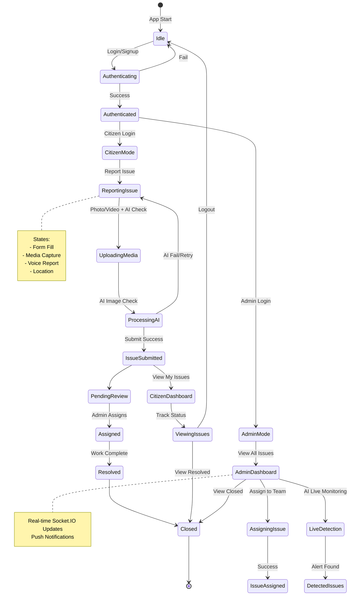

# CivicSense App - State Chart Diagram & Components

## 🗺️ **State Chart Diagram** (Mermaid Syntax)
Copy to [mermaid.live](https://mermaid.live) to visualize.



## 🏗️ **Components Breakdown**

### **Backend Components** (`Backend/`)
```
server.js (Main)
├── Routes
│   ├── authRoute.js (Login/Signup/JWT)
│   └── issueRoute.js (CRUD Issues)
├── Controllers
│   ├── authController.js (Auth logic)
│   └── issueController.js (Issue ops)
├── Models (Mongoose)
│   ├── User.js (name, email, role, isActive)
│   └── IssueReport.js (title, desc, media[], status, location)
├── Middleware
│   └── auth.js (JWT verify)
└── Socket.IO (Real-time updates)
```

### **Frontend Components** (`Frontend/src/`)
```
App.js (Router)
├── Pages
│   ├── Login/Signup (Auth)
│   ├── CitizenDashboard (My Issues)
│   ├── ReportIssue (Capture + AI Check)
│   ├── AdminDashboard (All Issues)
│   └── AdminLiveDetection (RT Monitoring)
├── Components
│   ├── LanguageSelector (i18n)
│   ├── EmergencyAlertSystem (Push)
│   └── VoiceReporter (Speech-to-text)
├── Utils
│   ├── aiImageDetector.js (Fake image check)
│   └── voiceReporter.js
└── i18n (EN/HI/TE)
```

## 🔄 **Key State Transitions**
| From → To | Trigger | Component |
|-----------|---------|-----------|
| Idle → Authenticating | User clicks Login | Login Page |
| ReportingIssue → ProcessingAI | Submit Photo | aiImageDetector |
| PendingReview → Assigned | Admin assigns | AdminDashboard |
| Any → Push Notification | Status change | Socket.IO + WebPush |

**Usage**: Paste Mermaid code to mermaid.live for interactive diagram. Components map directly to files.

